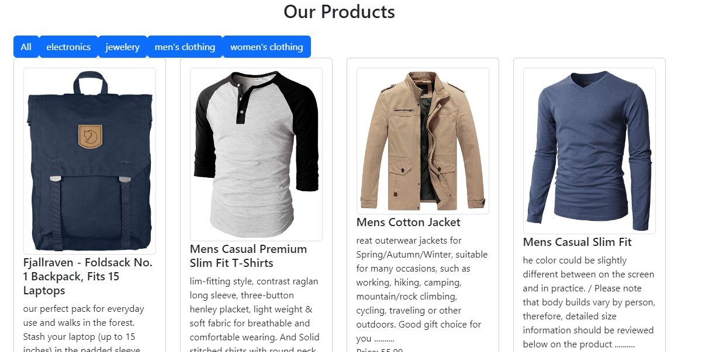
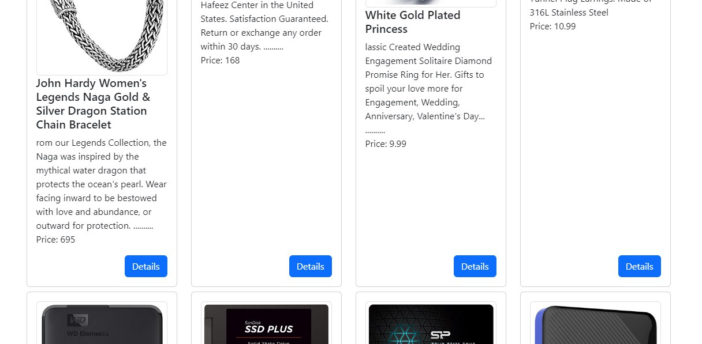
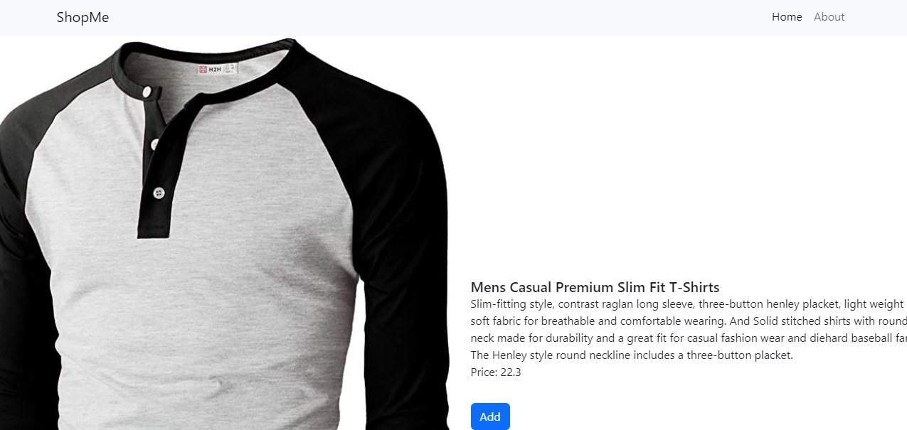

# Shopmefy

## 📝 Table of Contents

- [About](#about)
- [Technologies used](#build)
- [getting started](#start)
- [screenshots](#screenshots)

### 🚩About<a name = "about"></a>

Shopmefy is an ecommerce website for shopping in different categories.  


## 💻Technologies Used<a name = "build"></a>

- React
- React-Router dom

## 🏁Getting Started <a name = "start"></a>

1. **_Clone the repository_**

```bash
git clone [https://github.com/Omaar2000/shopmefy]

```

2. **_Go to the directory of the repository_**

```bash
cd crud

```

3. **_Run_**

```bash
npm install
npm start
```

**_runs at port 3000_**

## 🎥 screenshots<a name = "screenshots"></a>

- Products Page
  
  
  <hr />

- Products Page
  

  <hr />

- Details page
  

  <hr />
